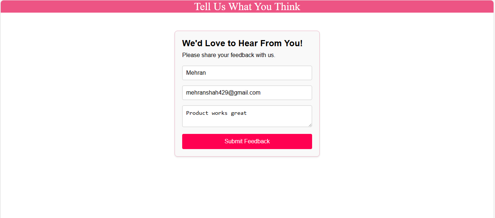
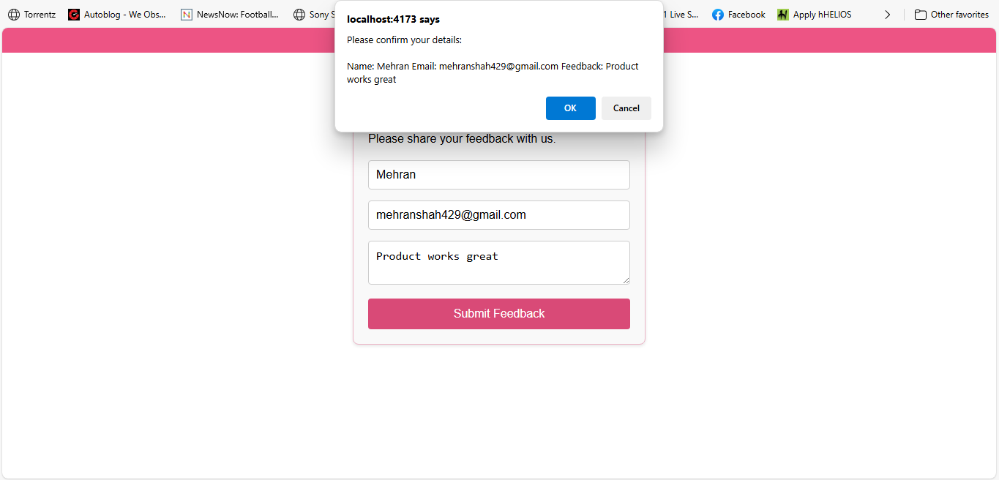

# 📝 FeedbackForm App

## 📋 Project Overview

**FeedbackForm** is a simple yet functional React application that collects user feedback through a user-friendly interface. This component-based app demonstrates the core principles of React, including:

- ✅ Component creation  
- ✅ Controlled form inputs  
- ✅ State management using `useState`  
- ✅ Event handling  
- ✅ Conditional rendering  
- ✅ Form validation and confirmation  

---

## 🚀 Features

- ✅ Clean and intuitive feedback form  
- ✅ Real-time input handling using controlled components  
- ✅ Confirmation prompt before submission  
- ✅ Responsive layout with basic CSS styling  
- ✅ Feedback submission with form reset and thank-you alert  

---

## 🛠️ Technologies Used

- ⚛️ React (with Hooks)  
- 💛 JavaScript (ES6+)  
- 🧾 HTML5  
- 🎨 CSS3  

---

## 💻 How It Works

1. The user enters their **Name**, **Email**, and **Feedback** in the form.
2. As the user types, the data is stored in React state via the `useState` hook.
3. On form submission:
   - A browser confirmation dialog shows the entered information.
   - If the user confirms, the data is printed to the console and a thank-you alert is shown.
   - The form resets to allow for new entries.

---

## 📸 Sample Screenshots

### 🖼️ Default View

### ✅ Confirmation Dialog and Submission

---

